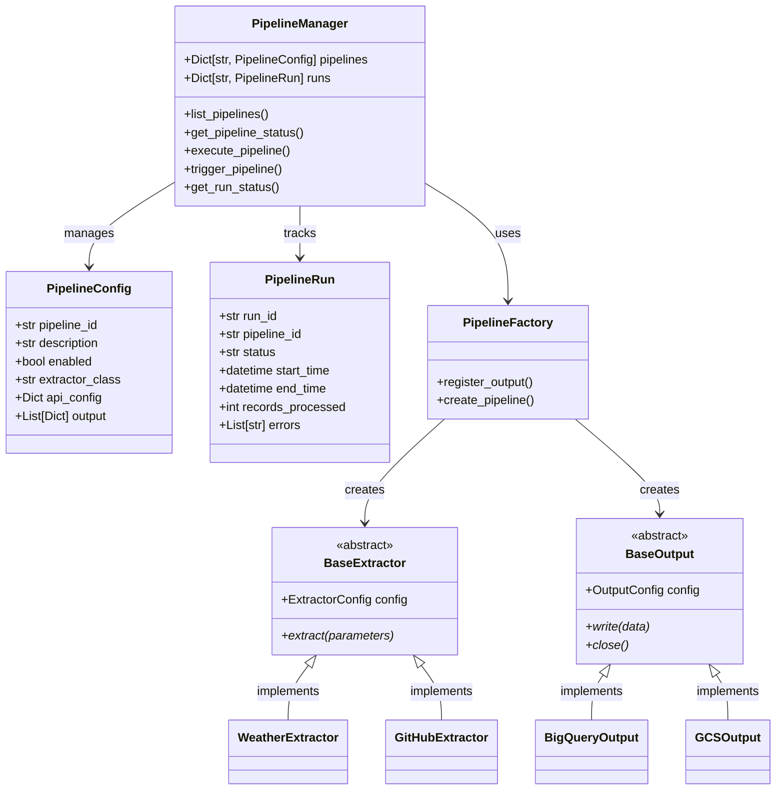
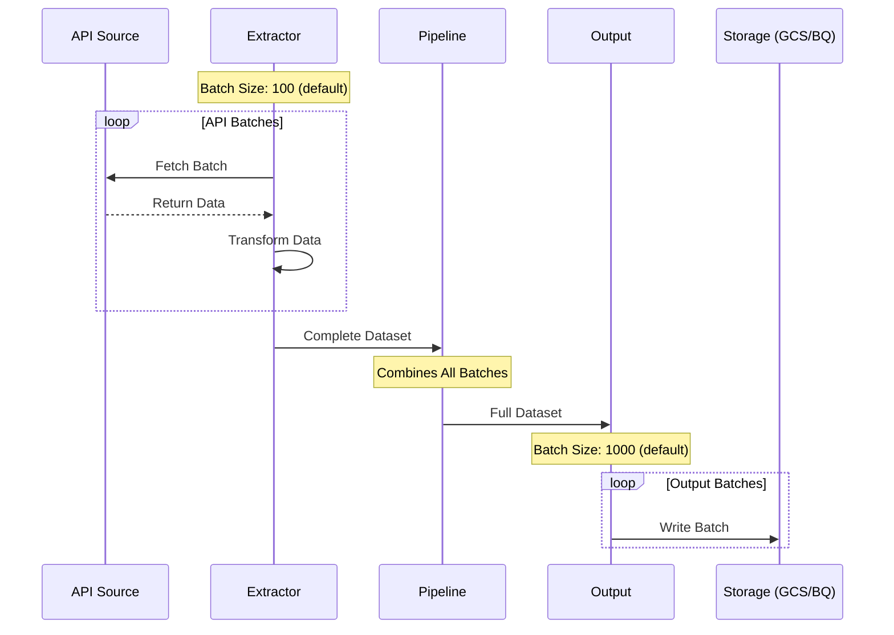
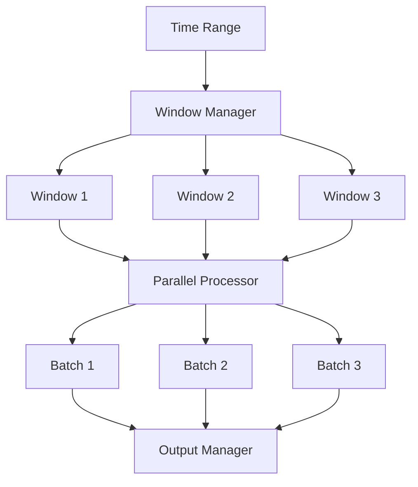

# API Pipeline System Design

## Overview

The API Pipeline system is a scalable and extensible framework for extracting data from various APIs and loading it into different output destinations. The system is designed with modularity, flexibility, and reliability in mind.

## Architecture

### High-Level Components

```
┌─────────────────┐     ┌──────────────┐     ┌────────────────┐
│  API Sources    │     │   Pipeline    │     │    Outputs     │
│  (REST/GraphQL) │────▶│   Manager    │────▶│ (BigQuery/GCS) │
└─────────────────┘     └──────────────┘     └────────────────┘
                              │
                        ┌─────┴─────┐
                        │   Config   │
                        │   Store    │
                        └───────────┘
```

### Core Components

1. **Pipeline Factory**
   - Creates pipeline instances
   - Manages component lifecycle
   - Handles configuration

2. **Authentication System**
   - OAuth 2.0 with refresh tokens
   - API key authentication
   - Extensible auth handlers
   - Secure secret management

3. **Extractors**
   - Data source abstraction
   - Concurrent processing
   - Rate limiting
   - Error handling

4. **Outputs**
   - BigQuery integration
   - GCS support
   - Local development output
   - Schema validation

5. **Pipeline Manager**
   - Orchestration
   - Status tracking
   - Error handling
   - Metrics collection

## Core Components Class Diagram



## Core Components Interaction

### 1. Base Framework (`base.py`)
- Provides abstract base classes `BaseExtractor` and `BaseOutput`
- Defines configuration models `ExtractorConfig` and `OutputConfig`
- Enables extensibility through abstract methods
- Forms the foundation for all data source and output implementations

### 2. Data Models (`models.py`)
- Defines core data structures using Pydantic models
- `PipelineConfig`: Configuration for pipeline setup
- `PipelineRun`: Runtime execution state
- `PipelineStatus`: Status reporting structure
- Ensures type safety and validation

### 3. Factory Pattern (`factory.py`)
- Implements component creation logic
- Manages registration of output handlers
- Creates pipeline instances dynamically
- Enables plug-and-play architecture

### 4. Pipeline Manager (`pipeline_manager.py`)
- Central orchestrator of the system
- Manages pipeline configurations
- Handles pipeline execution flow
- Tracks execution status
- Provides monitoring interface

## Extensibility Points

1. **Adding New Data Sources**
   ```python
   class NewAPIExtractor(BaseExtractor):
       async def extract(self, parameters):
           # Implementation for new API
   ```

2. **Adding New Outputs**
   ```python
   class NewOutput(BaseOutput):
       async def write(self, data):
           # Implementation for new destination
   ```

3. **Registering New Components**
   ```python
   PipelineFactory.register_output("new_type", NewOutput)
   ```

## Flow of Control

1. **Pipeline Creation**
   - `PipelineManager` loads configurations
   - `PipelineFactory` creates components
   - Components are initialized with configs

2. **Pipeline Execution**
   - Manager triggers execution
   - Extractor fetches data
   - Data flows through transforms
   - Outputs write to destinations

3. **Status Tracking**
   - Run status is updated
   - Errors are captured
   - Metrics are collected

## Design Benefits

1. **Loose Coupling**
   - Components interact through interfaces
   - Implementation details are isolated
   - Easy to modify or replace components

2. **High Cohesion**
   - Each class has a single responsibility
   - Clear separation of concerns
   - Easy to maintain and test

3. **Extensibility**
   - New extractors can be added
   - New outputs can be integrated
   - Configurations are flexible

## Design Principles

1. **Modularity**
   - Pluggable architecture
   - Clear interface boundaries
   - Dependency injection
   - Factory pattern for components

2. **Reliability**
   - Error handling at all levels
   - Retry mechanisms
   - Comprehensive logging
   - Transaction management

3. **Scalability**
   - Asynchronous operations
   - Batch processing
   - Resource pooling
   - Configurable concurrency

4. **Maintainability**
   - Clear separation of concerns
   - Comprehensive documentation
   - Type hints and validation
   - Consistent coding standards

## Data Flow

1. **Authentication**
   - Load auth configuration
   - Initialize auth handler
   - Manage token lifecycle
   - Secure header generation

2. **Extraction**
   - Authenticate requests
   - Fetch data from source
   - Handle pagination
   - Transform data

3. **Processing**
   - Validate data
   - Apply transformations
   - Batch processing
   - Error handling

4. **Output**
   - Write to destinations
   - Schema enforcement
   - Partitioning
   - Cleanup

## Configuration Management

### Environment-Specific Config
```yaml
service:
  name: api-pipeline
  version: 1.0.0
  log_level: INFO

rate_limits:
  default_rps: 500
  max_concurrent: 200
```

### Pipeline Config
```yaml
pipeline_id: weather_api
extractor_class: WeatherExtractor
output:
  - type: bigquery
    config:
      dataset_id: raw_data
      table_id: weather
  - type: gcs
    enabled: true
    config:
      bucket: data-lake
```

## Security

1. **Authentication**
   - OAuth 2.0 support
   - Automatic token refresh
   - Secure credential storage
   - Environment isolation

2. **Secret Management**
   - Google Cloud Secret Manager
   - Environment-specific secrets
   - Credential rotation
   - Access control

3. **Access Control**
   - IAM integration
   - Service accounts
   - Minimal permissions
   - Audit logging

## Monitoring and Observability

1. **Metrics**
   - Pipeline success rates
   - Data volume metrics
   - Processing latency
   - Resource utilization

2. **Logging**
   - Structured logging
   - Error tracking
   - Audit trails
   - Performance monitoring

3. **Alerting**
   - Pipeline failures
   - Rate limit warnings
   - Resource exhaustion
   - Data quality issues

## Future Enhancements

1. **Planned Features**
   - Schema evolution handling
   - Real-time processing
   - Data quality checks
   - Advanced monitoring

2. **Scalability Improvements**
   - Distributed processing
   - Dynamic scaling
   - Cache optimization
   - Performance tuning

3. **Integration Options**
   - Additional data sources
   - New output formats
   - Workflow integration
   - API gateway support

## Batch Processing and Data Flow

### Batch Processing Architecture



### Multi-Level Batching

1. **Extractor Level Batching**
   - Default batch size: 100 records
   - Purpose: Optimize API calls and memory usage
   - Process:
     ```python
     async def extract(self):
         all_data = []
         for batch in batches:
             batch_data = await self._process_batch(batch)
             all_data.extend(batch_data)
         return all_data  # Complete dataset
     ```

2. **Pipeline Level**
   - Acts as a data aggregator
   - Collects all extractor batches
   - Passes complete dataset to outputs
   - No batching at this level

3. **Output Level Batching**
   - Default batch size: 1000 records (GCS example)
   - Purpose: Optimize storage writes
   - Process:
     ```python
     async def write(self, data):
         for record in data:
             current_batch.append(record)
             if len(current_batch) >= batch_size:
                 await self._write_batch()
     ```

### Example Data Flow

For a dataset of 2500 records:

1. **Extraction Phase**
   - 25 API batches of 100 records each
   - Each batch processed concurrently (up to max_concurrent_requests)
   - All batches combined into single dataset

2. **Pipeline Phase**
   - Receives complete dataset (2500 records)
   - Passes to configured outputs

3. **Output Phase (GCS Example)**
   - Breaks 2500 records into output batches
   - Creates 3 files:
     - File 1: 1000 records
     - File 2: 1000 records
     - File 3: 500 records

### Batch Configuration

```yaml
api_config:
  # Extractor batch settings
  batch_size: 100
  max_concurrent_requests: 10
  rate_limit: 60

output:
  - type: "gcs"
    config:
      # Output batch settings
      batch_size: 1000
      file_format: "jsonl"
```

### Benefits of Multi-Level Batching

1. **Performance Optimization**
   - Efficient API data fetching
   - Controlled memory usage
   - Optimized storage writes

2. **Resource Management**
   - Rate limiting at API level
   - Controlled concurrent requests
   - Efficient file management

3. **Reliability**
   - Independent batch error handling
   - Partial success capability
   - Clear error tracking per batch 

## Parallel Processing and Window Management

### Window-Based Processing Architecture



### Window Processing Strategy

1. **Time Window Division**
   - Large time ranges split into fixed windows
   - Default window size: 24 hours
   - Configurable via `window_size` parameter
   ```python
   window_config = WindowConfig(
       window_type=WindowType.FIXED,
       window_size="24h",
       window_offset="0m"
   )
   ```

2. **Parallel Window Processing**
   - Concurrent processing of multiple windows
   - Controlled by `max_concurrent_requests`
   - Semaphore-based concurrency control
   ```python
   async def _process_windows(self, windows):
       semaphore = asyncio.Semaphore(self.config.max_concurrent_requests)
       async with semaphore:
           return await asyncio.gather(*[self._process_window(w) for w in windows])
   ```

3. **Window-Level Watermarking**
   - Track progress per window
   - Prevent duplicate processing
   - Enable incremental updates
   ```python
   async def _update_window_watermark(self, window_end):
       self._watermark_store[self._get_watermark_key()] = window_end
   ```

### Enhanced Batch Processing

1. **Multi-Level Batching**
   - API-level batching (configurable size)
   - Window-level batching (time-based)
   - Output-level batching (storage optimization)

2. **Batch Size Optimization**
   ```python
   # Extractor level
   batch_size = min(
       self.config.batch_size,
       self.config.rate_limit // self.config.max_concurrent_requests
   )
   
   # Output level
   output_batch_size = min(
       self.config.output_batch_size,
       available_memory // estimated_record_size
   )
   ```

3. **Memory Management**
   - Controlled batch loading
   - Immediate batch processing
   - Efficient resource cleanup
   ```python
   async def _process_batch(self, batch):
       try:
           result = await self._transform_batch(batch)
           await self._write_batch(result)
       finally:
           # Clean up batch resources
           del batch
   ```

### Performance Monitoring

1. **Window Metrics**
   ```python
   window_metrics = {
       'window_start': window.start_time,
       'window_end': window.end_time,
       'processing_time': processing_duration,
       'records_processed': record_count,
       'batch_count': batch_count
   }
   ```

2. **Batch Performance**
   ```python
   batch_metrics = {
       'batch_size': len(batch),
       'processing_time': batch_duration,
       'memory_usage': current_memory,
       'success_rate': successful_records / total_records
   }
   ```

3. **Resource Utilization**
   - Memory usage per batch
   - Processing time per window
   - Concurrent operations count
   - I/O operations monitoring

### Error Handling and Recovery

1. **Window-Level Recovery**
   ```python
   async def _process_window_with_retry(self, window):
       for attempt in range(max_retries):
           try:
               return await self._process_window(window)
           except Exception as e:
               if attempt == max_retries - 1:
                   raise
               await asyncio.sleep(retry_delay)
   ```

2. **Batch-Level Error Handling**
   ```python
   async def _process_batch_safe(self, batch):
       try:
           return await self._process_batch(batch)
       except Exception as e:
           logger.error(f"Batch processing failed: {str(e)}")
           self._metrics['failed_batches'] += 1
           return []
   ```

3. **Partial Success Handling**
   - Track failed records
   - Continue processing valid records
   - Report detailed error metrics 