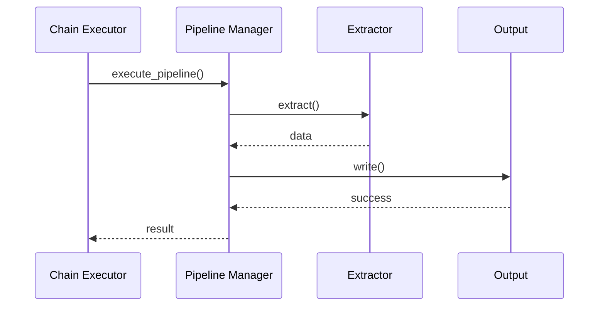
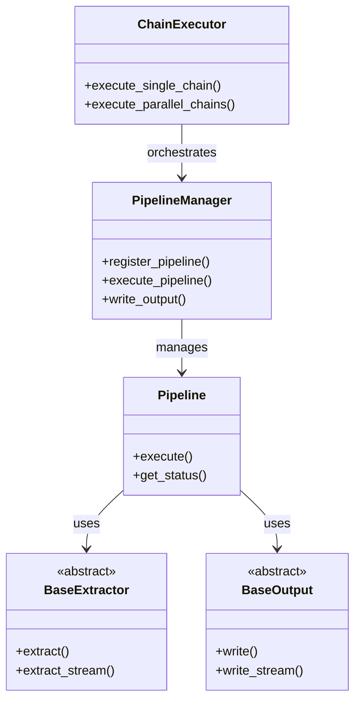

# API Pipeline System Design

## I. Overview

A framework for extracting data from APIs and loading it into output destinations. 

### Key Features
- Chain-based orchestration for API data extraction
- Individual pipeline management for single extractors
- Core framework with extensible components
- Reliable error handling and retries
- Built-in monitoring and metrics

## II. Architecture

### High-Level Components

```
                                Chain Layer
┌────────────────────────────────────────────────────────────┐
│                                                            │
│   ┌──────────────┐          ┌──────────────┐              │
│   │   Chain      │          │    State     │              │
│   │  Executor    │◄────────►│   Manager    │              │
│   └──────┬───────┘          └──────────────┘              │
│          │                                                 │
└──────────┼─────────────────────────────────────────────────┘
           │
           │ orchestrates 1:N pipelines
           │
           ▼
┌─────────────────── Base Pipeline ──────────────────────────┐
│                                                            │
│  ┌──────────────┐    ┌──────────────┐    ┌──────────────┐ │
│  │  Extractor   │───►│   Pipeline   │───►│    Output    │ │
│  └──────────────┘    │   Manager    │    └──────────────┘ │
│                      └──────────────┘                      │
└────────────────────────────────────────────────────────────┘
```

### Component Interaction



### Class Diagram



## III. Core Concepts

### Chain vs Pipeline
- **Chain**: Orchestrates multiple pipelines, manages state between steps
- **Pipeline**: Handles single extractor-to-output flow, manages resources

### Processing Modes
1. **Single**
   - Direct processing of individual items
   - Used for simple API calls

2. **Sequential**
   - Ordered processing of list items
   - Maintains execution order
   - Suitable for dependent operations

3. **Parallel**
   - Concurrent processing of list items
   - Configurable concurrency limits
   - Best for independent operations

### State Management
- Chain state persists between steps
- Pipeline state tracks execution
- Watermarks for incremental processing
- Error state for recovery

### Error Handling
- Configurable retry strategies
- Per-step error policies
- Chain-level recovery
- Partial success handling

## IV. Implementation

### Configuration Examples

1. **Chain Configuration**
```yaml
chain_id: example_chain
extractors:
  - extractor_class: FirstExtractor
    processing_mode: single
    input_mapping:
      source_param: chain_input
    output_mapping:
      result: next_input

  - extractor_class: SecondExtractor
    processing_mode: parallel
    input_mapping:
      data: next_input
```

2. **Pipeline Configuration**
```yaml
pipeline_id: example_pipeline
extractor:
  class: DataExtractor
  batch_size: 100
  max_concurrent: 10

output:
  type: json
  config:
    format: jsonl
    partition_by: date
```

### Common Patterns

1. **Incremental Processing**
```yaml
watermark:
  enabled: true
  field: timestamp
  window_size: 1h
```

2. **Error Recovery**
```yaml
error_handling:
  mode: continue
  max_retries: 3
  backoff: exponential
```

## V. Technical Details

### Batch Processing

1. **Extractor Level**
```python
async def extract(self, parameters: Dict[str, Any]) -> List[Dict[str, Any]]:
    batches = self._create_batches(parameters)
    results = []
    
    for batch in batches:
        batch_data = await self._process_batch(batch)
        results.extend(batch_data)
    
    return results
```

2. **Pipeline Level**
```python
async def execute_pipeline(self, pipeline_id: str, parameters: Dict[str, Any]) -> None:
    pipeline = self.get_pipeline(pipeline_id)
    data = await pipeline.extract(parameters)
    await self.write_output(pipeline_id, data)
```

3. **Output Level**
```python
async def write(self, data: List[Dict[str, Any]]) -> None:
    for batch in self._batch_data(data, self.batch_size):
        await self._write_batch(batch)
```

### Streaming Implementation

1. **Extractor Streaming**
```python
async def extract_stream(self, parameters: Dict[str, Any]) -> AsyncIterator[Dict[str, Any]]:
    async for item in self._fetch_data(parameters):
        transformed = await self._transform_item(item)
        yield transformed
```

2. **Pipeline Streaming**
```python
async def execute_stream(self, pipeline_id: str, parameters: Dict[str, Any]) -> None:
    pipeline = self.get_pipeline(pipeline_id)
    async for item in pipeline.extract_stream(parameters):
        await self.write_output(pipeline_id, [item])
```

### Chain Execution

1. **Single Chain**
```python
async def execute_single_chain(self, config: ChainConfig, parameters: Dict[str, Any]) -> Dict[str, Any]:
    state = {}
    
    for step in config.extractors:
        input_data = self._map_input(state, step.input_mapping)
        result = await self._execute_step(step, input_data)
        self._update_state(state, step.output_mapping, result)
    
    return state
```

2. **Parallel Chains**
```python
async def execute_parallel_chains(
    self,
    config: ChainConfig,
    parameters_list: List[Dict[str, Any]]
) -> List[Dict[str, Any]]:
    semaphore = asyncio.Semaphore(config.max_parallel_chains)
    
    async def execute_with_semaphore(params):
        async with semaphore:
            return await self.execute_single_chain(config, params)
    
    return await asyncio.gather(*[
        execute_with_semaphore(params)
        for params in parameters_list
    ])
```

## VI. Operations

### Monitoring
- Pipeline success rates
- Processing latency
- Resource utilization
- Error rates

### Security
- OAuth 2.0 and API key support
- Secure credential management
- Access control integration

### Performance
- Batch size tuning
- Concurrency settings
- Memory management
- Caching strategies

## VII. Core Framework Features

### Parallel Processing

1. **Configurable Strategies**
```python
class ParallelConfig:
    strategy: ParallelProcessingStrategy  # TIME_WINDOWS, KNOWN_PAGES, CALCULATED_OFFSETS
    max_concurrent: int
    batch_size: Optional[int]
    error_handling: ErrorHandlingMode
```

2. **Implementation Patterns**
```python
# Time-based parallel processing
async def _process_time_windows(self, parameters: Dict[str, Any]) -> List[Dict[str, Any]]:
    windows = self._calculate_time_windows(
        start_time=parameters['start_time'],
        end_time=parameters['end_time'],
        window_size=self.config.window_size
    )
    
    async def process_window(window):
        window_params = {
            **parameters,
            'start_time': window.start,
            'end_time': window.end
        }
        return await self._process_window(window_params)
    
    return await asyncio.gather(*[
        process_window(window) for window in windows
    ])

# Offset-based parallel processing
async def _process_calculated_offsets(self, parameters: Dict[str, Any]) -> List[Dict[str, Any]]:
    total_items = await self._get_total_count(parameters)
    chunks = self._calculate_chunks(total_items, self.config.chunk_size)
    
    async def process_chunk(start: int, end: int):
        chunk_params = {
            **parameters,
            'offset': start,
            'limit': end - start
        }
        return await self._process_chunk(chunk_params)
    
    return await asyncio.gather(*[
        process_chunk(start, end) for start, end in chunks
    ])
```

### Batching System

1. **Multi-Level Batching**
```python
# API-level batching
class BatchConfig:
    batch_size: int = 100
    max_concurrent_batches: int = 10
    retry_failed_batches: bool = True

# Output-level batching
class OutputBatchConfig:
    batch_size: int = 1000
    flush_interval: int = 60  # seconds
    max_batch_bytes: int = 5_000_000  # 5MB
```

2. **Batch Processing Flow**
```python
async def _process_batch(self, items: List[Any]) -> List[Dict[str, Any]]:
    # Pre-process batch
    batch_params = self._prepare_batch_parameters(items)
    
    # Execute with retry
    async with self._batch_semaphore:
        try:
            response = await self._execute_with_retry(
                self._make_batch_request,
                batch_params
            )
            return self._transform_batch_response(response)
        except Exception as e:
            self._handle_batch_error(e, items)
            return []
```

### Windowing

1. **Window Types**
```python
class WindowType(str, Enum):
    FIXED = "fixed"          # Fixed-size windows
    SLIDING = "sliding"      # Overlapping windows
    SESSION = "session"      # Dynamic session-based
    GLOBAL = "global"        # Single window for all data
```

2. **Window Configuration**
```python
class WindowConfig:
    window_type: WindowType
    window_size: str = "24h"        # e.g., "1h", "30m"
    window_offset: str = "0m"       # Window start offset
    window_overlap: str = "0m"      # For sliding windows
    session_gap: str = "30m"        # For session windows
    timestamp_field: str            # Field to window on
```

3. **Window Processing**
```python
def _calculate_windows(
    self,
    start_time: datetime,
    end_time: datetime,
    config: WindowConfig
) -> List[TimeWindow]:
    if config.window_type == WindowType.FIXED:
        return self._calculate_fixed_windows(start_time, end_time, config)
    elif config.window_type == WindowType.SLIDING:
        return self._calculate_sliding_windows(start_time, end_time, config)
    elif config.window_type == WindowType.SESSION:
        return self._calculate_session_windows(self.data, config)
    else:
        return [TimeWindow(start_time, end_time)]
```

### Watermarking

1. **Watermark Configuration**
```python
class WatermarkConfig:
    enabled: bool = True
    timestamp_field: str
    max_lateness: str = "1h"
    watermark_interval: str = "5m"
    allowed_lateness: str = "30m"
```

2. **Watermark Tracking**
```python
class WatermarkTracker:
    def __init__(self, config: WatermarkConfig):
        self.config = config
        self._watermarks: Dict[str, datetime] = {}
    
    async def update_watermark(self, key: str, event_time: datetime) -> None:
        current = self._watermarks.get(key, datetime.min)
        self._watermarks[key] = max(current, event_time)
    
    def get_watermark(self, key: str) -> datetime:
        return self._watermarks.get(key, datetime.min)
    
    def is_late(self, event_time: datetime, key: str) -> bool:
        watermark = self.get_watermark(key)
        max_lateness = parse_duration(self.config.max_lateness)
        return event_time < watermark - max_lateness
```

### Pagination

1. **Pagination Strategies**
```python
class PaginationType(str, Enum):
    PAGE_NUMBER = "page_number"  # ?page=1&per_page=100
    CURSOR = "cursor"           # ?cursor=abc123
    OFFSET = "offset"           # ?offset=100&limit=50
    LINK = "link"              # Link header based
```

2. **Strategy Implementation**
```python
class LinkHeaderStrategy(PaginationStrategy):
    async def get_next_page_params(
        self,
        current_params: Dict[str, Any],
        response: Dict[str, Any],
        page_number: int
    ) -> Optional[Dict[str, Any]]:
        links = response.get('headers', {}).get('Link', '')
        for link in links.split(','):
            if 'rel="next"' in link:
                url = link.split(';')[0].strip()[1:-1]
                return self._parse_url_params(url)
        return None

class CursorStrategy(PaginationStrategy):
    async def get_next_page_params(
        self,
        current_params: Dict[str, Any],
        response: Dict[str, Any],
        page_number: int
    ) -> Optional[Dict[str, Any]]:
        next_cursor = response.get(self.config.cursor_field)
        if next_cursor:
            return {
                **current_params,
                self.config.cursor_param: next_cursor
            }
        return None
```

3. **Pagination Flow**
```python
async def _paginated_request(
    self,
    endpoint: str,
    params: Dict[str, Any]
) -> List[Dict[str, Any]]:
    strategy = self.config.pagination.strategy
    all_items = []
    page_params = strategy.get_initial_params(params)
    
    while True:
        response = await self._make_request(endpoint, page_params)
        items = self._extract_items(response)
        all_items.extend(items)
        
        next_params = await strategy.get_next_page_params(
            page_params, response, len(all_items)
        )
        if not next_params:
            break
            
        page_params = next_params
    
    return all_items
```

### Rate Limiting

1. **Rate Limit Configuration**
```python
class RateLimitConfig:
    requests_per_second: int
    max_concurrent: int
    window_size: int = 1
    fair_sharing: bool = True
```

2. **Rate Limiter Implementation**
```python
class RateLimiter:
    def __init__(self, config: RateLimitConfig):
        self.config = config
        self._semaphore = asyncio.Semaphore(config.max_concurrent)
        self._window_start = time.monotonic()
        self._request_count = 0
    
    async def acquire(self):
        async with self._semaphore:
            await self._wait_for_rate_limit()
            self._request_count += 1
    
    async def _wait_for_rate_limit(self):
        current_time = time.monotonic()
        window_elapsed = current_time - self._window_start
        
        if window_elapsed >= self.config.window_size:
            self._window_start = current_time
            self._request_count = 0
        elif self._request_count >= self.config.requests_per_second:
            sleep_time = self.config.window_size - window_elapsed
            await asyncio.sleep(sleep_time)
            self._window_start = time.monotonic()
            self._request_count = 0
```

These core features work together to provide a robust and flexible framework for API data extraction:

- **Parallel Processing** enables efficient handling of large datasets
- **Batching** optimizes resource usage and API calls
- **Windowing** supports time-based data processing
- **Watermarking** ensures data completeness and handles late arrivals
- **Pagination** handles large result sets efficiently
- **Rate Limiting** prevents API throttling and ensures fair resource usage 

## VIII. Core Design Principles

### 1. Separation of Concerns

The framework is built on clear separation of responsibilities:

```python
# Each component has a single, well-defined responsibility
class BaseExtractor(ABC):
    """Handles data extraction from API sources."""
    @abstractmethod
    async def extract(self, parameters: Dict[str, Any]) -> List[Dict[str, Any]]: ...

class BaseOutput(ABC):
    """Handles writing data to destinations."""
    @abstractmethod
    async def write(self, data: List[Dict[str, Any]]) -> None: ...

class PipelineManager:
    """Coordinates extractor and output interactions."""
    async def execute_pipeline(self, pipeline_id: str, parameters: Dict[str, Any]) -> None: ...
```

### 2. Composition Over Inheritance

The framework favors composition to build complex functionality:

```python
class GitHubExtractor(BaseExtractor):
    def __init__(self, config: ExtractorConfig):
        self.auth_handler = create_auth_handler(config.auth_config)
        self.retry_handler = RetryHandler(config.retry)
        self.watermark_handler = WatermarkHandler(config.watermark)
        self.rate_limiter = RateLimiter(config.rate_limit)
```

### 3. Strategy Pattern for Flexibility

Different strategies can be plugged in without changing core logic:

```python
# Pagination strategies
class PaginationStrategy(ABC):
    @abstractmethod
    async def get_next_page_params(self, current_params, response, page_number): ...

class LinkHeaderStrategy(PaginationStrategy):
    async def get_next_page_params(self, current_params, response, page_number):
        # Link header specific implementation
        ...

class CursorStrategy(PaginationStrategy):
    async def get_next_page_params(self, current_params, response, page_number):
        # Cursor based implementation
        ...
```

### 4. Configuration as Code

All behaviors are configurable through type-safe configuration objects:

```python
@dataclass
class ExtractorConfig:
    # Base configuration
    base_url: str
    endpoints: Dict[str, str]
    
    # Optional features
    pagination: Optional[PaginationConfig] = None
    watermark: Optional[WatermarkConfig] = None
    retry: Optional[RetryConfig] = None
    rate_limit: Optional[RateLimitConfig] = None
```

### 5. Resource Management

Careful handling of system resources:

```python
class ResourceManager:
    def __init__(self, config: ResourceConfig):
        self._semaphore = asyncio.Semaphore(config.max_concurrent)
        self._memory_limit = config.memory_limit
        self._cleanup_interval = config.cleanup_interval

    async def __aenter__(self):
        await self._acquire_resources()
        return self

    async def __aexit__(self, *args):
        await self._release_resources()
```

### 6. Error Handling and Recovery

Comprehensive error handling at all levels:

```python
class ErrorHandler:
    async def handle_error(self, error: Exception, context: Dict[str, Any]) -> None:
        # 1. Log error with context
        logger.error(f"Error in {context['component']}: {str(error)}")
        
        # 2. Update metrics
        self._metrics[error.__class__.__name__] += 1
        
        # 3. Execute recovery strategy
        if self._can_retry(error):
            await self._retry_operation(context)
        else:
            await self._handle_permanent_failure(context)
```

### 7. Extensibility

Easy to extend with new components:

```python
# 1. Define new extractor
class CustomAPIExtractor(BaseExtractor):
    async def extract(self, parameters: Dict[str, Any]) -> List[Dict[str, Any]]:
        # Custom implementation
        ...

# 2. Define new output
class CustomOutput(BaseOutput):
    async def write(self, data: List[Dict[str, Any]]) -> None:
        # Custom implementation
        ...

# 3. Register with factory
ExtractorFactory.register("custom_api", CustomAPIExtractor)
OutputFactory.register("custom_output", CustomOutput)
```

### 8. Observability

Built-in monitoring and debugging capabilities:

```python
class Metrics:
    def __init__(self):
        self.counters = defaultdict(int)
        self.gauges = defaultdict(float)
        self.histograms = defaultdict(list)

    def track_operation(self, operation: str, duration: float):
        self.counters[f"{operation}_count"] += 1
        self.histograms[f"{operation}_duration"].append(duration)
```

### 9. Asynchronous by Design

Async/await for efficient I/O operations:

```python
class AsyncPipeline:
    async def execute(self, parameters: Dict[str, Any]) -> None:
        async with AsyncResourceManager() as resources:
            # 1. Parallel data extraction
            data = await asyncio.gather(*[
                self._extract_chunk(chunk) 
                for chunk in self._create_chunks(parameters)
            ])
            
            # 2. Concurrent processing
            processed = await asyncio.gather(*[
                self._process_item(item) 
                for item in data
            ])
            
            # 3. Batched output
            await self._write_batches(processed)
```

### 10. Immutable State

State changes are explicit and traceable:

```python
@dataclass(frozen=True)
class PipelineState:
    id: str
    status: Status
    parameters: Dict[str, Any]
    results: List[Dict[str, Any]]
    errors: List[Dict[str, Any]]

class StateManager:
    def update_state(self, current_state: PipelineState, updates: Dict[str, Any]) -> PipelineState:
        return PipelineState(
            id=current_state.id,
            status=updates.get('status', current_state.status),
            parameters=updates.get('parameters', current_state.parameters),
            results=updates.get('results', current_state.results),
            errors=updates.get('errors', current_state.errors)
        )
```

These design principles ensure the framework is:
- **Maintainable**: Clear separation of concerns and modular design
- **Extensible**: Easy to add new components and features
- **Reliable**: Comprehensive error handling and resource management
- **Observable**: Built-in monitoring and debugging
- **Performant**: Efficient async operations and resource utilization
- **Type-Safe**: Configuration as code with validation
- **Flexible**: Pluggable strategies for different requirements 