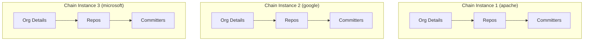

# Extractor Chaining Design

## Overview

Extractor chaining enables the composition of multiple extractors to create complex data pipelines where the output of one extractor becomes the input for another. This feature is particularly useful for APIs with nested or related resources.

## Use Cases

1. **GitHub Organization Analysis**
   ```
   Organization → Repositories → Committers & Last Commits
   ```
   - Start with organization details
   - For each org, fetch all repositories
   - For each repository, get committer details and their last commits

2. **GitHub Repository Dependencies**
   ```
   Repository → Dependencies → Security Advisories
   ```
   - Start with repository details
   - For each repo, fetch dependency manifest
   - For each dependency, check security advisories

3. **Weather Station Data**
   ```
   Stations → Historical Data → Anomalies
   ```
   - Get list of weather stations
   - For each station, fetch historical data
   - Analyze data for anomalies

## Design

### 1. Chain Configuration

```python
class ChainConfig(BaseModel):
    """Configuration for extractor chain."""
    chain_id: str                              # Unique identifier for the chain
    extractors: List[ChainedExtractorConfig]   # List of extractors in sequence
    max_parallel_chains: int = 5               # Max parallel chain executions
    error_handling: ChainErrorStrategy         # How to handle errors in chain
    output_mapping: Dict[str, str]             # Map extractor outputs to chain outputs
    cache_strategy: Optional[CacheConfig]      # Optional caching between steps

class ChainedExtractorConfig(BaseModel):
    """Configuration for a single extractor in a chain."""
    extractor_class: str                       # Extractor class to use
    config: ExtractorConfig                    # Extractor configuration
    input_mapping: Dict[str, str]              # Map chain inputs to extractor params
    output_mapping: Dict[str, str]             # Map extractor outputs to chain data
    filter_condition: Optional[str]            # Optional filter for input data
    batch_size: Optional[int]                  # Override batch size for this step
```

### 2. Chain Execution Model



#### Sequential Nature of Individual Chains
Each chain instance is inherently sequential:
1. Step outputs feed into subsequent steps
2. Cannot skip or parallelize steps within a chain
3. Must maintain data dependencies between steps

#### Parallel Chain Instances
While each chain is sequential, multiple chains can run in parallel:
1. Different organizations can be processed simultaneously
2. Each chain maintains its own context and state
3. `max_parallel_chains` controls how many chains run at once

Example:
```python
# These organizations will be processed in parallel chains
orgs_to_process = ["apache", "google", "microsoft", "facebook", "netflix"]

# Each chain is sequential, but up to 5 different orgs processed at once
chain_config = ChainConfig(
    chain_id="github_org_analysis",
    max_parallel_chains=5,  # Process up to 5 orgs simultaneously
    extractors=[...]  # Sequential steps for each org
)

# Execute parallel chain instances
results = await chain_executor.execute_parallel_chains(
    chain_config,
    [{"organization_name": org} for org in orgs_to_process]
)
```

### 3. Chain Context

```python
class ChainContext:
    """Maintains state and data flow between extractors."""
    chain_id: str                              # Chain identifier
    data_store: Dict[str, Any]                # Shared data between extractors
    metrics: ChainMetrics                      # Chain-level metrics
    current_step: int                          # Current extractor in chain
    error_context: List[ChainError]           # Error tracking
```

### 4. Example Configuration

```yaml
chain_id: github_org_analysis
extractors:
  - extractor_class: GitHubOrgExtractor
    config:
      base_url: "https://api.github.com"
      endpoints:
        current: "/orgs/{org}"
    input_mapping:
      org: "organization_name"
    output_mapping:
      repos_url: "repos_endpoint"

  - extractor_class: GitHubReposExtractor
    config:
      base_url: "https://api.github.com"
      endpoints:
        current: "{repos_endpoint}"
    input_mapping:
      endpoint: "repos_endpoint"
    output_mapping:
      repos: "repository_list"
    batch_size: 100

  - extractor_class: GitHubCommittersExtractor
    config:
      base_url: "https://api.github.com"
      endpoints:
        current: "/repos/{full_name}/commits"
    input_mapping:
      repo_data: "repository_list"
    output_mapping:
      committers: "committer_details"
    batch_size: 50
```

### 5. Implementation Strategy

#### 5.1 Chain Manager
```python
class ChainManager:
    """Manages execution of extractor chains."""
    
    async def execute_chain(self, chain_config: ChainConfig, initial_params: Dict[str, Any]) -> ChainResult:
        """Execute a chain of extractors."""
        context = ChainContext(chain_config.chain_id)
        
        for extractor_config in chain_config.extractors:
            # Map inputs from context to extractor parameters
            params = self._map_inputs(extractor_config.input_mapping, context)
            
            # Create and execute extractor
            extractor = self._create_extractor(extractor_config)
            results = await extractor.extract(params)
            
            # Store results in context using output mapping
            self._store_results(results, extractor_config.output_mapping, context)
            
        return ChainResult(context)
```

#### 5.2 Parallel Processing
```python
class ChainExecutor:
    """Handles parallel execution of chains."""
    
    async def execute_parallel_chains(
        self,
        chain_config: ChainConfig,
        input_items: List[Dict[str, Any]]
    ) -> List[ChainResult]:
        """Execute multiple chains in parallel."""
        semaphore = asyncio.Semaphore(chain_config.max_parallel_chains)
        
        async def execute_with_semaphore(params):
            async with semaphore:
                return await self.chain_manager.execute_chain(chain_config, params)
        
        return await asyncio.gather(*[
            execute_with_semaphore(params)
            for params in input_items
        ])
```

### 6. Error Handling

```python
class ChainErrorStrategy(str, Enum):
    FAIL_FAST = "fail_fast"           # Stop chain on first error
    CONTINUE = "continue"             # Continue chain, mark step as failed
    RETRY = "retry"                   # Retry failed steps
    SKIP = "skip"                     # Skip failed items, continue with others

class ChainError:
    """Detailed error information for chain execution."""
    step: int                         # Step where error occurred
    extractor: str                    # Extractor that failed
    error: Exception                  # Original error
    context: Dict[str, Any]          # Context at time of error
    retry_count: int                  # Number of retry attempts
```

### 7. Metrics and Monitoring

```python
class ChainMetrics:
    """Metrics for chain execution."""
    start_time: datetime
    end_time: Optional[datetime]
    steps_completed: int
    total_items_processed: int
    errors_encountered: int
    retry_attempts: int
    processing_time_per_step: Dict[int, float]
    memory_usage: Dict[int, float]
    throughput: float
```

## Benefits

1. **Modularity**
   - Each extractor focuses on one API resource
   - Easy to compose complex workflows
   - Reusable extractor components

2. **Flexibility**
   - Configurable data mapping between steps
   - Multiple error handling strategies
   - Optional caching and optimization

3. **Performance**
   - Parallel chain execution
   - Batch processing within chains
   - Resource-aware scheduling

4. **Monitoring**
   - Chain-level metrics
   - Detailed error tracking
   - Performance analysis per step

## Implementation Plan

### Phase 1: Core Framework
1. Implement chain configuration models
2. Build basic chain manager
3. Add context management
4. Implement sequential execution

### Phase 2: Advanced Features
1. Add parallel processing
2. Implement error handling strategies
3. Add metrics collection
4. Build caching system

### Phase 3: Optimization
1. Add resource management
2. Implement adaptive batching
3. Add performance monitoring
4. Optimize memory usage

## Example Usage

```python
# Create chain configuration
chain_config = ChainConfig(
    chain_id="github_org_analysis",
    extractors=[
        ChainedExtractorConfig(
            extractor_class="GitHubOrgExtractor",
            config=org_config,
            input_mapping={"org": "organization_name"},
            output_mapping={"repos_url": "repos_endpoint"}
        ),
        ChainedExtractorConfig(
            extractor_class="GitHubReposExtractor",
            config=repos_config,
            input_mapping={"endpoint": "repos_endpoint"},
            output_mapping={"repos": "repository_list"}
        ),
        ChainedExtractorConfig(
            extractor_class="GitHubCommittersExtractor",
            config=commits_config,
            input_mapping={"repo_data": "repository_list"},
            output_mapping={"committers": "committer_details"}
        )
    ],
    max_parallel_chains=5,
    error_handling=ChainErrorStrategy.RETRY
)

# Execute chain
chain_manager = ChainManager()
results = await chain_manager.execute_chain(
    chain_config,
    {"organization_name": "apache"}
)
```

## Future Enhancements

1. **Dynamic Chaining**
   - Runtime chain modification
   - Conditional execution paths
   - Dynamic resource allocation

2. **Advanced Caching**
   - Distributed cache support
   - Cache invalidation strategies
   - Selective caching policies

3. **Chain Templates**
   - Predefined chain patterns
   - Template customization
   - Chain composition from templates

4. **Visualization**
   - Chain execution visualization
   - Performance dashboards
   - Error analysis tools
``` 